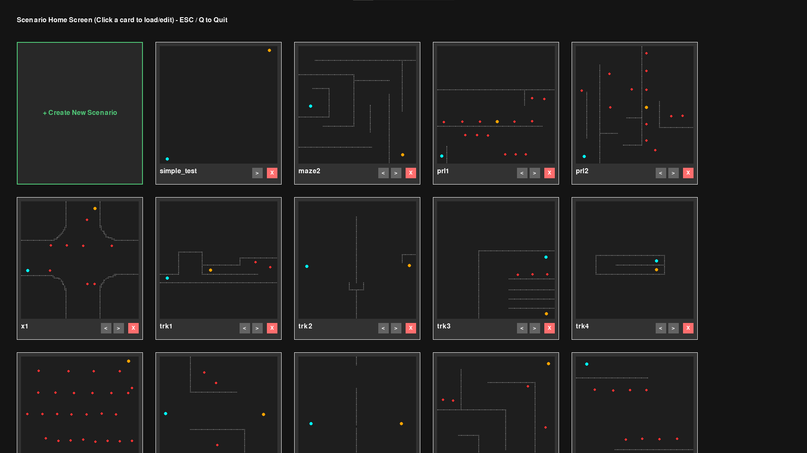
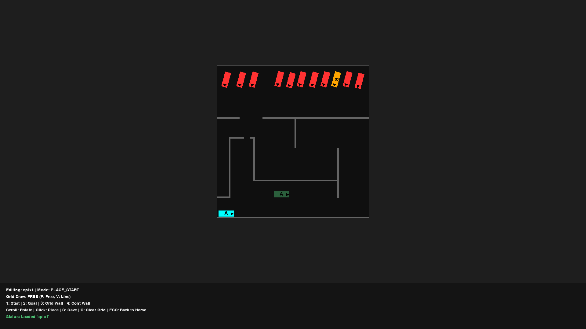
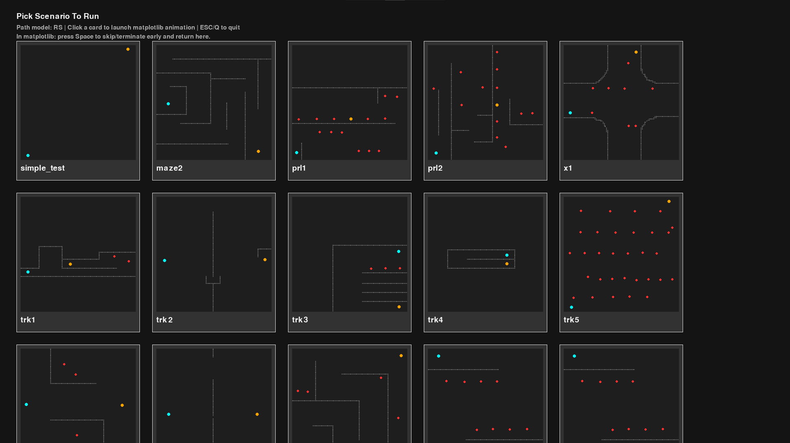
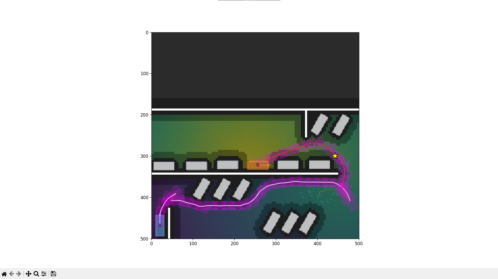
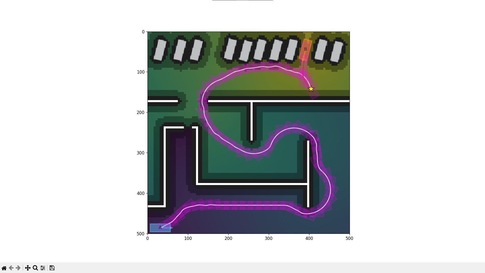
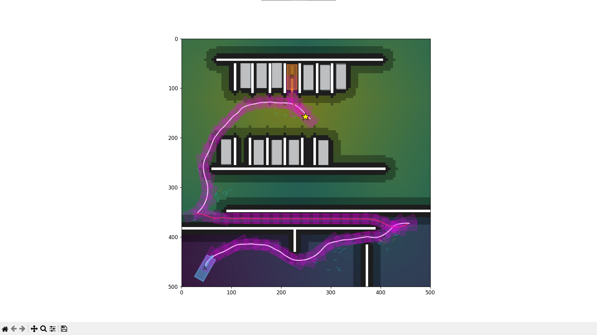

# Hybrid A* Playground

This repository demonstrate the **Hybrid A* algorithm** as the path-planner for a kinematic bicycle model that has reverse gear (can go backwards, aka Reeds Shepp path).

Check out the technical breakdown here:

- [Blog post](https://yuk068.github.io/2026/04/26/hybrid-a-star-playground-overview)


## Scenario Builder

You can create your own scenarios using:

```bash
python scenario_builder.py
```



### Editor Guide



You can switch between 4 objects with number keys:

| Key | Object |
|---|---|
| `1` | Car's start position |
| `2` | Goal |
| `3` | Walls (grid tiles) |
| `4` | Obstacle car |

- For `1`, `2`, `4`, these are continuous objects, you can use the mouse scroll wheel to change their orientation.
- For `3`, there are 2 draw modes: Press `F` for `Free` mode and `V` for `Line` mode.

All scenarios are saved in `scenario.json`

## Algorithm Visualization

You can pick any scenarios to run visualization using:

```bash
python main.py
```



Click on a scenario to see `matplotlib`-powered animation, a few examples:







Note: If the algorithm hasn't finish searching (pink snake path hasn't been instantiated yet), you can press `Space` to skip the scenario and return to Home Page (might need to click on the plot first though). When searching is finished (either pink snake path is present or if search failed - ghost box turns from red to black), then you need to press `Alt + F4` to return to Home Page.

## Setup Configuration

You can customize various parameters in `config.yml`.